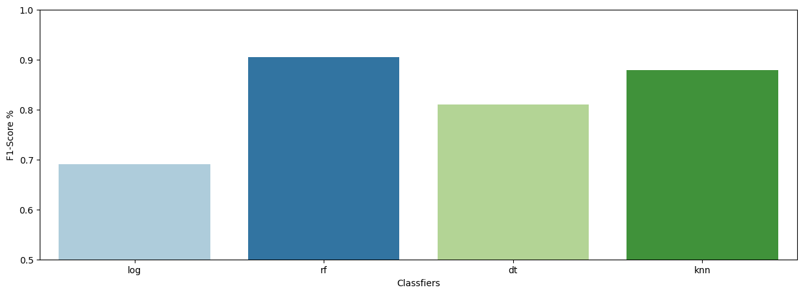

# cardiovacular-risk-prediction
This project aims to predict the 10-year risk of coronary heart disease (CHD) in patients by employing advanced machine learning techniques. It encompasses extensive data preprocessing, exploratory data analysis (EDA), and the application of the Synthetic Minority Over-sampling Technique (SMOTE) to balance the dataset. Utilizing Python and its libraries like Pandas for data manipulation and scikit-learn for model development, this project demonstrates the potential of machine learning in healthcare by accurately classifying individuals based on their risk of developing CHD.

## Motivation
Cardiovascular disease (CVD) are many different conditions relates the heart and blood vessels and include coronary heart disease, atrial fibrillation, rheumatic heart disease and other conditions. Cardiovascular diseases (CVDs) are the leading cause of death globally. An estimated 17.9 million people died from CVDs in 2016, representing 31% of all global deaths.

## Objective
- To preprocess and explore clinical and demographic data for identifying CHD risk factors.
- To utilise SMOTE to balance the dataset, ensuring fair model performance across different groups.
- To develop, evaluate, and compare several machine learning models, including k-nearest neighbors, logistic regression, decision trees, and random forests, for predicting the 10-year risk of CHD.
- To employ GridSearchCV for model fine-tuning to optimize performance and select the model with the best F1 score for predicting CHD risk.

## Dataset
The [dataset](https://www.kaggle.com/datasets/christofel04/cardiovascular-study-dataset-predict-heart-disea) is publicly available on the Kaggle website and originates from an ongoing cardiovascular study conducted on residents of the town of Framingham, Massachusetts. It comprises over 4,000 records and 15 attributes, which document the patients' demographic, behavioral, and medical risk factors.

## Packages
- Python 3.*
- pandas
- numpy
- scikit-learn
- matplotlib
- seaborn
- imblearn

## Methodology
- **Data Preprocessing and EDA**: Conduct thorough data cleaning, normalization, and exploratory data analysis to identify key patterns and correlations relevant to CHD risk.
- **Balancing the Dataset**: Apply SMOTE to create a balanced dataset, addressing class imbalances to improve model accuracy and fairness.
- **Model Development and Comparison**: Four machine learning models—k-nearest neighbors, logistic regression, decision tree, and random forest—are developed and assessed. Each model's effectiveness is evaluated based on accuracy, precision, recall, and F1 score.
- **Model Fine-Tuning**: Use GridSearchCV to fine-tune hyperparameters of the most promising models, aiming to maximize the F1 score and overall predictive performance.
- **Model Selection**: Choose the model that demonstrates the highest F1 score and robust performance across metrics as the final predictive tool for the 10-year risk of CHD.

## Results
The random forest model with F1 score of 0.9045, after extensive tuning and evaluation, was identified as the best-performing model. It demonstrated exceptional capability in predicting the 10-year risk of CHD. This model's success underscores its potential as a reliable tool in healthcare settings for early detection and intervention planning.

